# 📚 Software Design - 2026

# Project: Chat Application with Bot Integration

## 👤 Student Information
* **Name:** Alexandru Mules
* **GitHub Username:** @AlexMules
* **Group:** 30232-2

---

## 📈 Submission Table
- Update this table before each assignment submission.

| Milestone  | Tag | Submission Date | Status |
| :--- | :--- | :--- | :--- |
| Project Deliverable 1 | `v1.0` | 28.03.2026 | 🟢 Submitted |
| Project Deliverable 2 | `v2.0` | 19.04.2026 | 🟢 Submitted |
| Project Deliverable 3 | `v3.0` | 10.05.2026 | 🟢 Submitted |
| Project Final Implementation | `v4.0` | 17.05.2026 | 🟢 Submitted |

> **Note:** To submit, make sure your work is pushed on the main branch, and create a tag 
- `git tag -a v1.0 -m "project deliverable 1 completed"`
- `git push origin v1.0`
- Go to your repository on GitHub, click on the "Tags" tab. If you see v1.0, your submission is successful.


## 1. Project Description
ChattyBot is a full-stack client-server chat application built on a layered architecture using ASP.NET Core 
and Blazor. It addresses the fragmentation of messaging platforms by unifying real-time conversation, 
utility tools, and gamified features directly inside a single, cohesive ecosystem. Users can seamlessly 
interact with an intelligent, rule-based chatbot capable of handling over 15 unique actions, including 
mathematical calculations, text encryption, multimedia recommendations, and multi-category trivia games.

Under the hood, the project leverages the Command design pattern to maintain a fully decoupled and extensible 
bot engine, replacing rigid conditional blocks with polymorphic execution logic. Security and session handling
are managed via secure JWT token authentication coupled with a custom client-side state provider that 
interacts with the browser's LocalStorage. Additionally, the platform ensures data portability by allowing 
full conversation exports into JSON and XML formats. The entire ecosystem maintains robust reliability through 
a rigorous testing infrastructure split into isolated unit tests with xUnit and bUnit, alongside full 
endpoint integration tests powered by WebApplicationFactory and an in-memory database context.

## 2. Technologies Used
* **Language:** C#(.NET 10 / ASP.NET Core Web API & Blazor WebAssembly), HTML, CSS
* **Database:** MySQL, Entity Framework Core In-Memory Database (Testing)
* **Libraries:** Blazored.LocalStorage, Microsoft.AspNetCore.Components.Authorization, Microsoft.EntityFrameworkCore, System.Text.Json, System.Net.Http.Json, xUnit, bUnit, NSubstitute, FluentAssertions, Microsoft.AspNetCore.Mvc.Testing (WebApplicationFactory)
* **Tools:** Visual Studio 2026 (IDE), Git & GitHub, Bootstrap Icons

## 3. Setup and Installation

1. **Prerequisites:** 
Before running the project locally, ensure you have the following installed on your system:
* **.NET 10 SDK** to compile and run the application.
* **MySQL Server** instance (local, XAMPP, or a Docker container) to host the database.
* **Visual Studio 2026** (or JetBrains Rider / VS Code) with the ASP.NET and web development workload.

2. **Installation:**

* **Clone the repository:**
	```bash
	git clone https://github.com/sd-s2-2026/project-AlexMules/tree/main
	cd ChattyBot
	```
* **Configure the Database Connection:**
	Navigate to the server project (ChattyBot.Server) and open appsettings.json or appsettings.Development.json. 
	Update the connection string with your MySQL server credentials:
	"ConnectionStrings": {
		"DefaultConnection": "Server=localhost;Port=3306;Database=ChattyBotDb;Uid=your_mysql_user;Pwd=your_mysql_password;"
	}
	
* **Apply EF Core Migrations:**
	Open a terminal in the root solution directory and run the following command to initialize the MySQL 
	database schema:
	```bash
	dotnet ef database update --project ChattyBot.Server
	```
* **Run the project:**
	Launch the solution via Visual Studio 2026 by configuring it to start both the server project 
	and the Blazor WebAssembly client). Alternatively, execute it from the terminal:
	```bash
	dotnet run --project ChattyBot.Server
	dotnet run --project ChattyBot.Client
	```
* Open your browser and navigate to the local URL provided in the terminal output 
   (typically https://localhost:7001 or http://localhost:5001).

## 4. Execution

Once the application is up and running in your browser, follow these steps to experience its core functionalities:

### 1. Account Creation and Authentication
Since the chat endpoints are secured using JWT tokens, you must authenticate to start a conversation:
* Click on **Register** to create a new user account by providing an email, username, and password.
* Log in with your new credentials. The client will securely store your token in `LocalStorage` and redirect you to the main workspace.

### 2. Starting a Conversation
* In the left sidebar, click the **New Chat** button.
* Enter a title for your conversation in the modal window and click **Create**.
* Your newly created conversation will appear at the top of the **Recent Conversations** list and open automatically.

### 3. Interacting with the Chatbot
Type your text in the bottom chat input area. To interact with the bot's dynamic engine, use any of the supported command patterns:
* Type `/help` to see the full layout of available modules.
* Use calculation rules like `/calc 25 * 4 + (10 / 2)` to get instant math evaluations.
* Launch interactive features such as `/trivia -gaming` or `/dice-duel`. Note that during trivia challenges, the message input box will lock down natively, prompting you to pick an answer choice directly from the specialized UI bubble to unlock the chat.

### 4. Managing Conversations and Data Export
* Hover over any conversation item in the sidebar list and click the **Three-Dots Menu** icon.
* Click **Rename** to update the chat's title using the modal overlay, or click **Delete** to wipe the conversation and its underlying history from the database completely.
* Click the **Export** icon located in the upper-right area of the chat header to safely download a local copy of your current chat history in either **JSON** or **XML** file structures.

### 5. Running the Test Suite
To execute the automated unit and integration tests verifying the stability of the component layout and data pipelines, open a terminal in the root solution folder and run:
```bash
dotnet test
```

## 5. Execution Screenshots

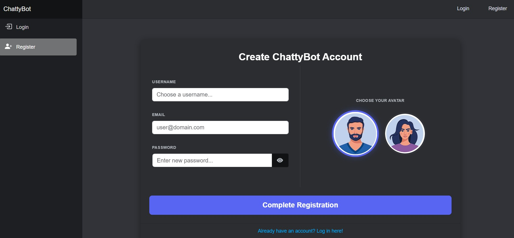
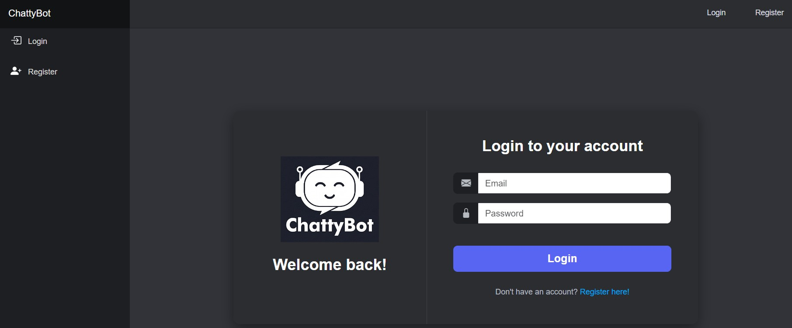
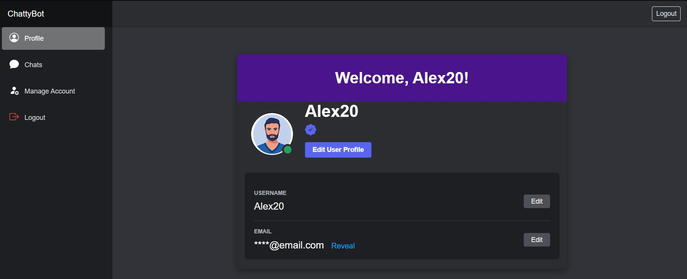
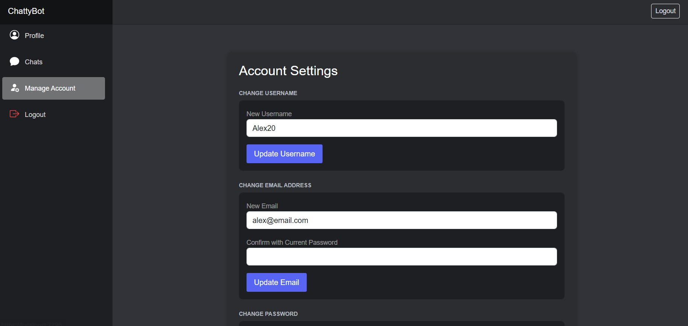
.jpg)
.jpg)
.jpg)
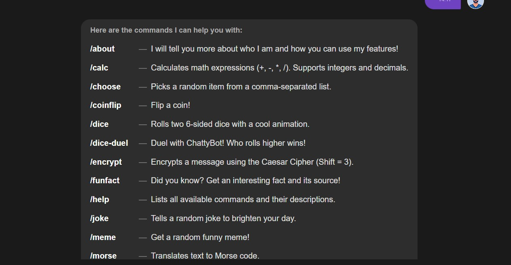
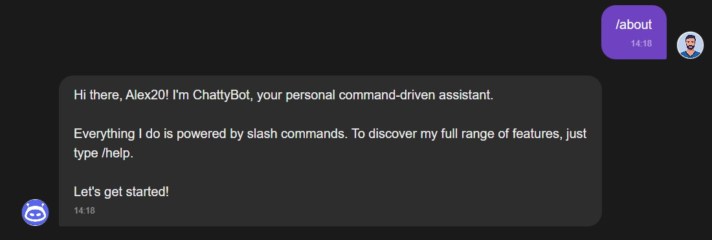
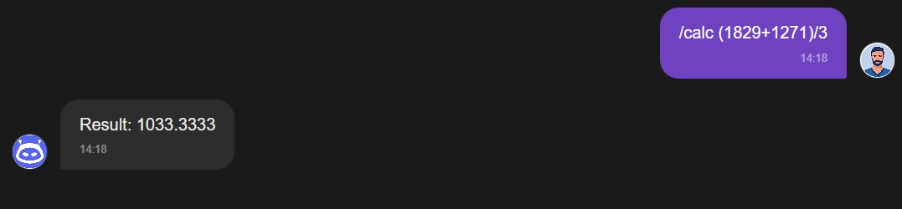
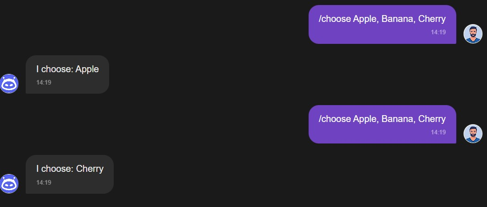
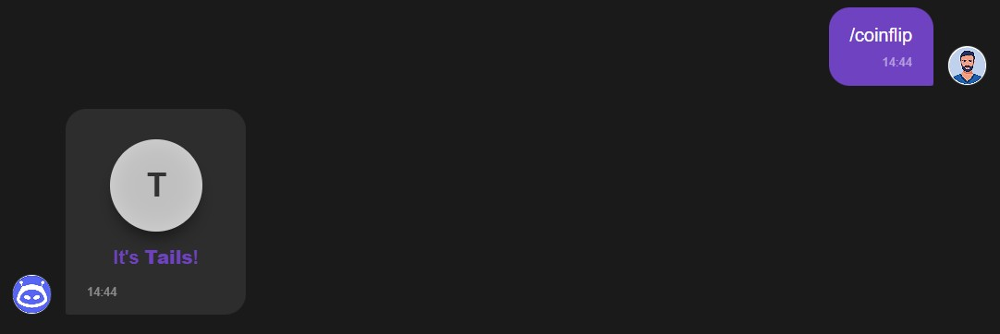
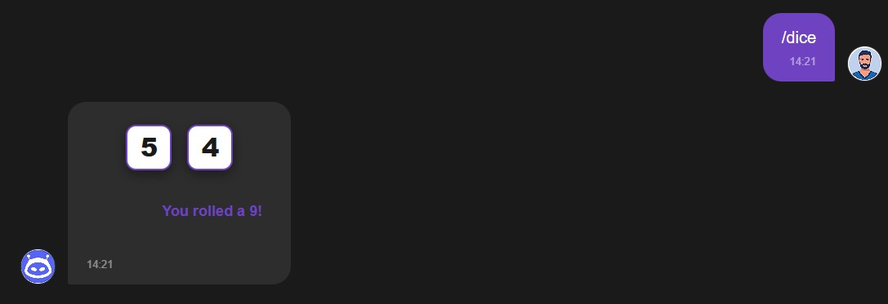
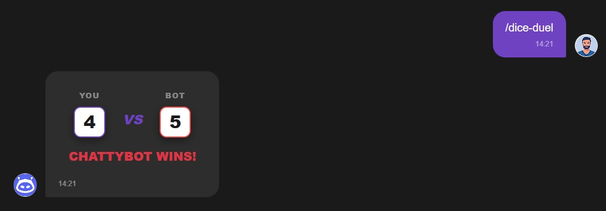
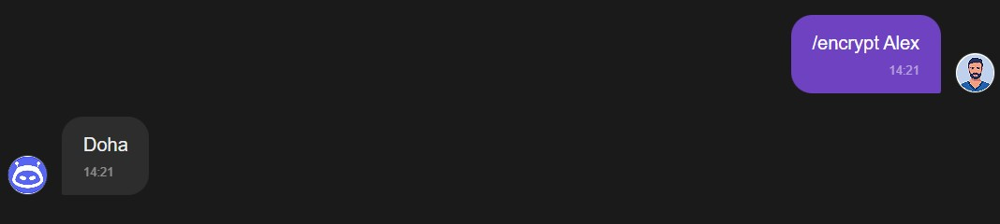
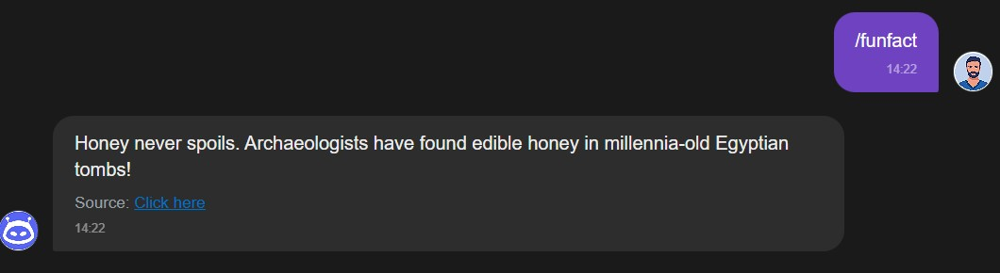
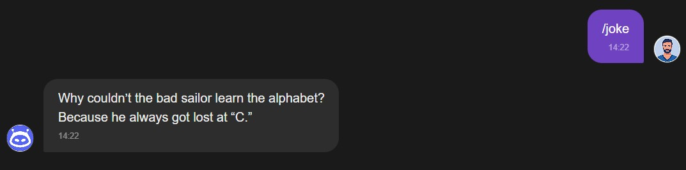
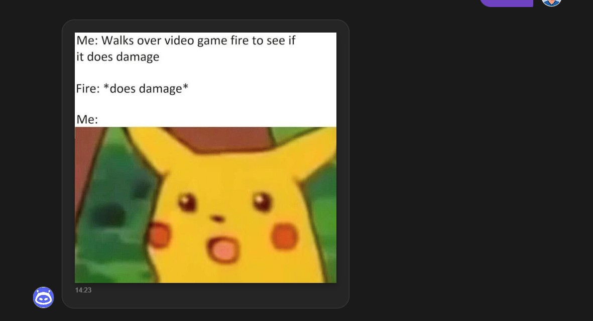
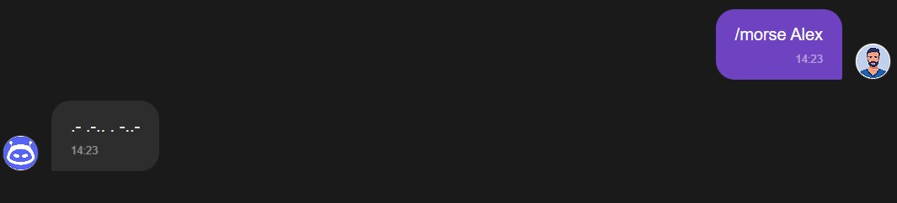
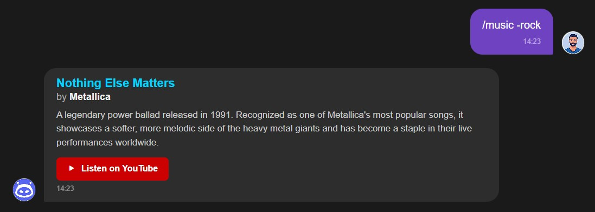
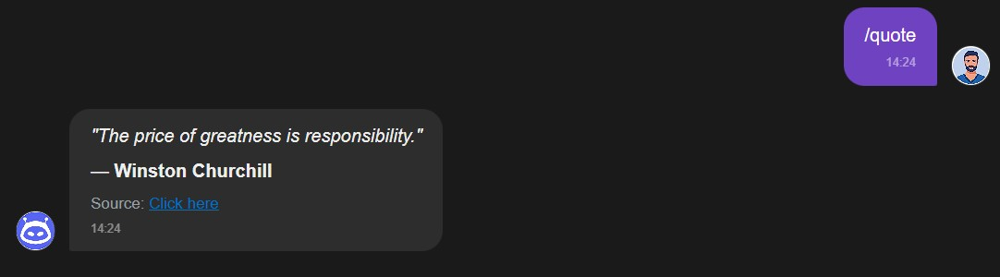
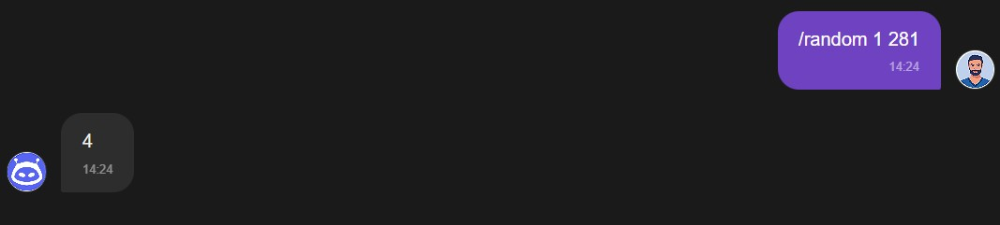
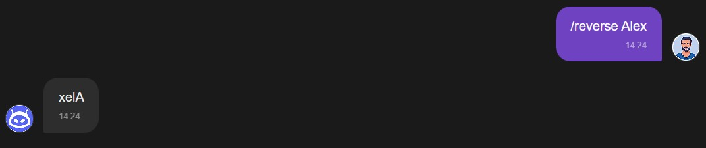
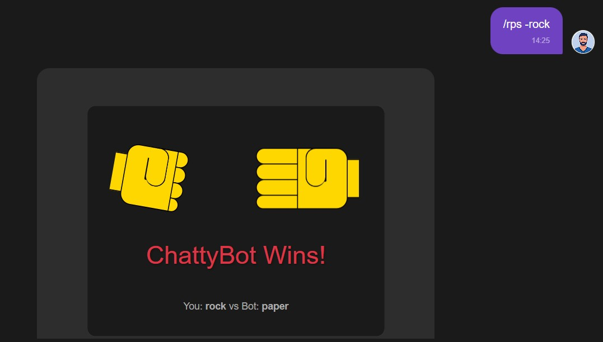
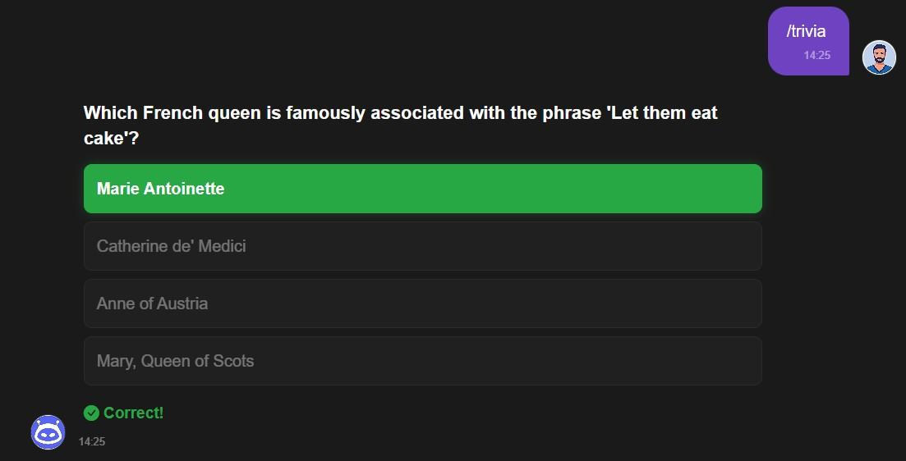
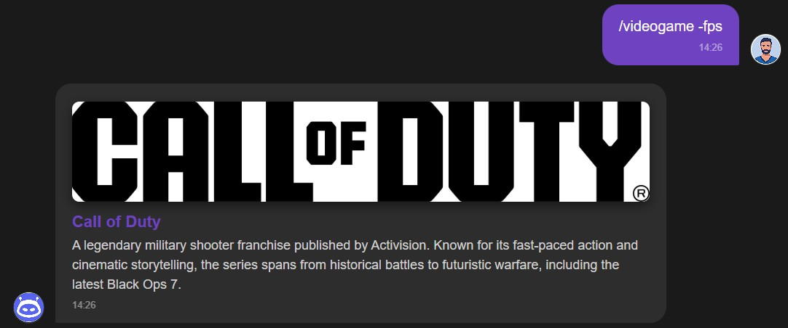

## 6. Known Issues

### Stateless JWT Token Invalidation on Logout
Currently, user logout is handled strictly on the client side by destroying the JSON Web Token (JWT) 
from the browser's `LocalStorage`. Because the backend API validates incoming tokens in a completely 
stateless manner, the token itself remains cryptographically valid on the server until its natural 
expiration time lapses. This introduces a vulnerability where an intercepted token could theoretically 
still be used to authorize requests even after a user has logged out.

To mitigate this limitation, the application requires a server-side token revocation mechanism. 
A standard industry resolution would involve integrating an in-memory cache layer like **Redis** 
to maintain a centralized token blacklist, allowing the backend to explicitly reject logged-out 
tokens on every incoming request until they safely expire.